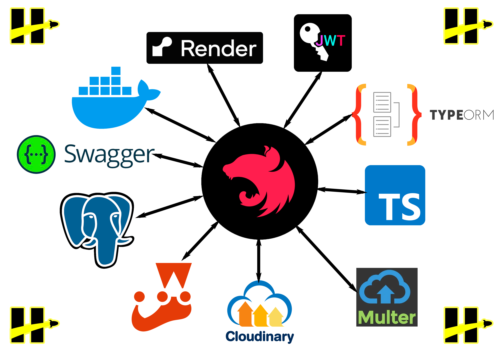
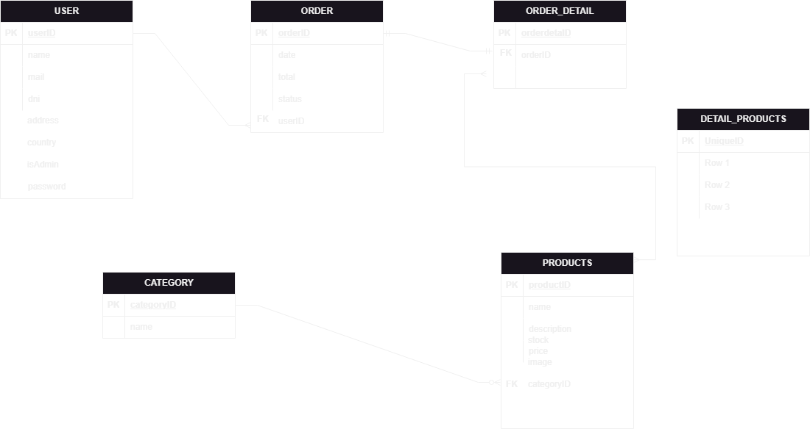

## **_E-COMMERCE - BACKEND_**

### **Autor**: GUSTAVO FEDERICO GALDEANO

### **Tecnologías utilizadas**:

 

### **DIAGRAMA ENTIDAD - RELACIÓN**:

 

### **Descripción**:
Proyecto BACKEND de un sistema ecommerce de gestión de inventario y compras en línea para una tienda de productos electrónicos. Utilizando medidas de seguridad atravez de tokens y roles para gestionar los usuarios y sus productos.

## **_TECNOLOGÍAS USADAS_**

NEST JS

TYPEORM

TYPESCRIPT

MULTER

CLOUDINARY

JEST

## **_DATA BASE_**

POSTGRESQL

## **_DEPLOYMENT_**

SWAGGER

DOCKER

RENDER
